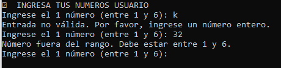

**Jhon Osorio Feria**  
**CFGS DAMv1**  
**Fecha: 02/11/2024**

## Juego de pruebas - Primer Menú

1. **Primera opción:** Te pide ingresar el número secreto.

2. **Segunda opción:** Ejecuta un número aleatorio automáticamente.

3. **Tercera opción:** Sale del juego.

---

## Juego de pruebas - Segundo Menú

1. **Primera opción:** Dificultad novato, 10 intentos fallidos.

2. **Segunda opción:** Dificultad personalizada (se eligen 3 intentos, se acierta al segundo).

---

## Juego de pruebas - Errores

- **Error en el primer menú:** Selección incorrecta de dígito o número.

- **Error en el segundo menú:** Formato o longitud de número incorrectos.

---

## Juego de pruebas - JUEGO

- **Un dígito correcto:**

- **Un dígito correcto en otra posición:**

- **Tres dígitos correctos en diferentes posiciones:**

- **Todos los dígitos correctos:**

